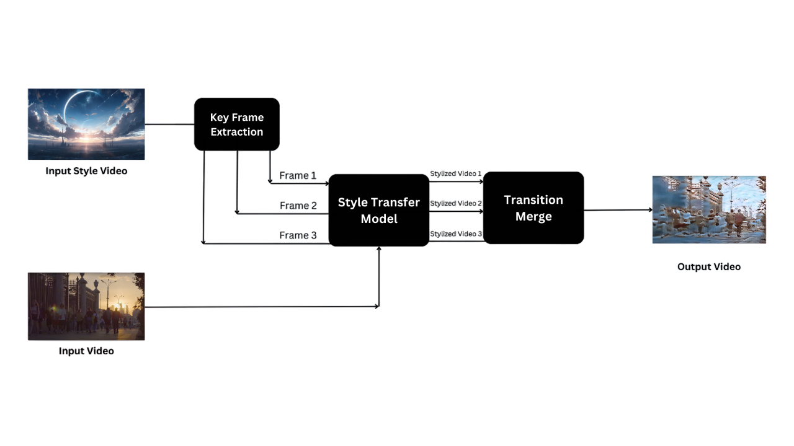
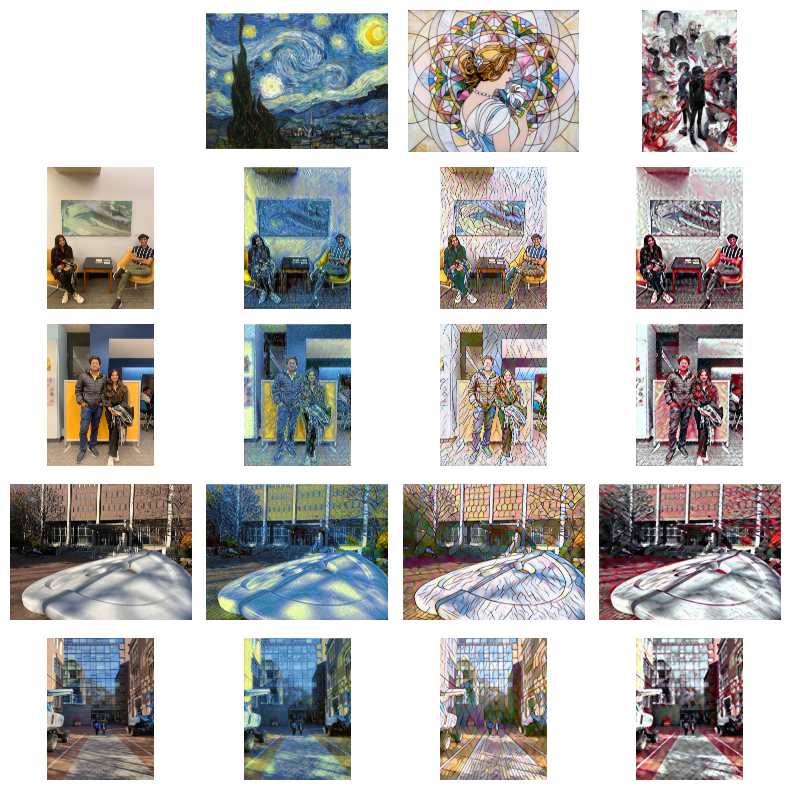
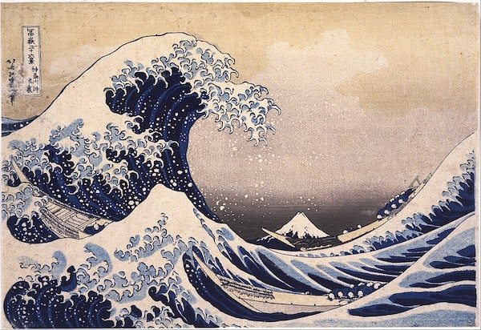

# Video-to-Video-Style-Transfer

- We aim to build upon Neural Style Transfer (NST) by extending its capabilities from static images to dynamic video content.
  
## Project Summary

- Our project extends Neural Style Transfer (NST) from static images to dynamic video content. NST merges content from one image with the style of another, creating visually striking visuals.
- Our innovation involves adapting NST for video data, extracting styles from one video and applying them to another. This opens new possibilities for artistic expression in video content, creating dynamic, style-transformed videos.
- Our approach involves developing custom neural network architectures to process video frames, extracting style features from one video and applying them seamlessly to another. The goal is to maintain artistic quality across frames, ensuring smooth style transfer in the target video.

## Repository Structure

1. **input_files:** Contains images and videos used as input to the models.
2. **style_images:** Holds images and videos used as styles for the model.
3. **Neural Style Transfer Model:** Python implementation of the Gatys et al neural style transfer paper.
4. **<TODO>**

## How to Run the Code

1. **Neural Style Transfer Model:**
    - Open the Model.ipynb file.
    - Specify input image/video path and style image path.
    - Run all cells of the notebook.
    - To save the stylized image, execute the `save_image` function.
    - To save the stylized video, run the last cell of the notebook.

2. **Arbitrary Image Stylization Model:**
    - <TODO>

## Outputs:

### Neural Style Transfer Model:

#### Image to Image

#### Image to Video:

Input Video: 

    <video width="320" height="240" controls>
        <source src="./input_files/adwait_video.mp4" type="video/mp4">
    </video>
    
Input Video

Style Images:

    

        
        
Style1

    

    

        
        
Style2

    

Output Videos:

        <video width="320" height="240" controls>
            <source src="./Neural Style Transfer Model/Outputs/output_adwait_style3.mp4" type="video/mp4">
        </video>
        
Output Video 1

    

    

        <video width="320" height="240" controls>
            <source src="./Neural Style Transfer Model/Outputs/output_adwait.mp4" type="video/mp4">
        </video>
        
Output Video 2

    

### Arbitrary Image Stylization Model:

<TODO>
